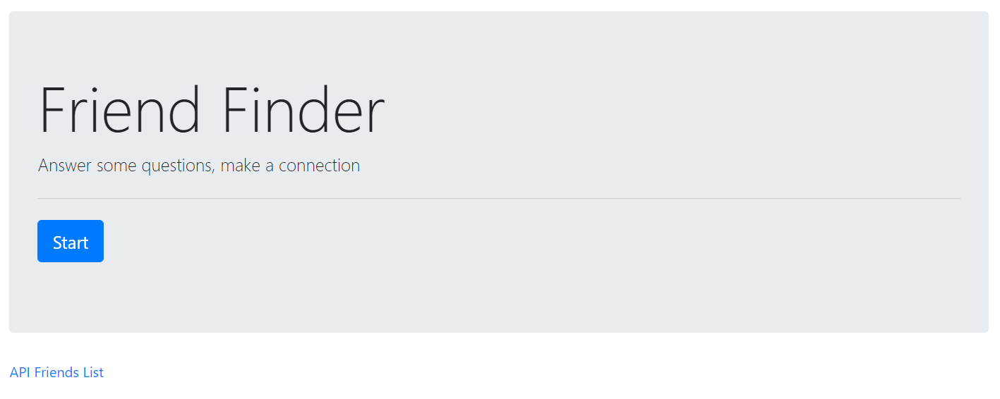
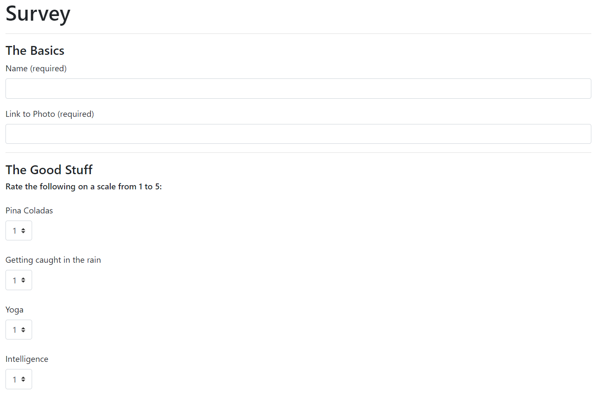
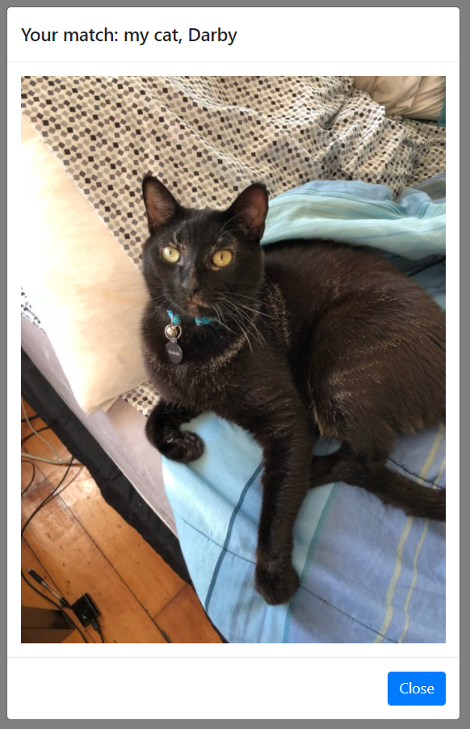

# FriendFinder
A full stack dating / friend finding app with questions based on the classic yacht rock song "Escape (The Pina Colada Song)"

# How It Works
When you open the site, you'll be greeted with a start page:

Once you click "start", fill out the survey which will ask you how you feel about pina coladas, getting caught in the rain, etc.

After completing the survey, you will be matched with your soulmate.

# Technologies Used
* Bootstrap
* Node.js
* Express

